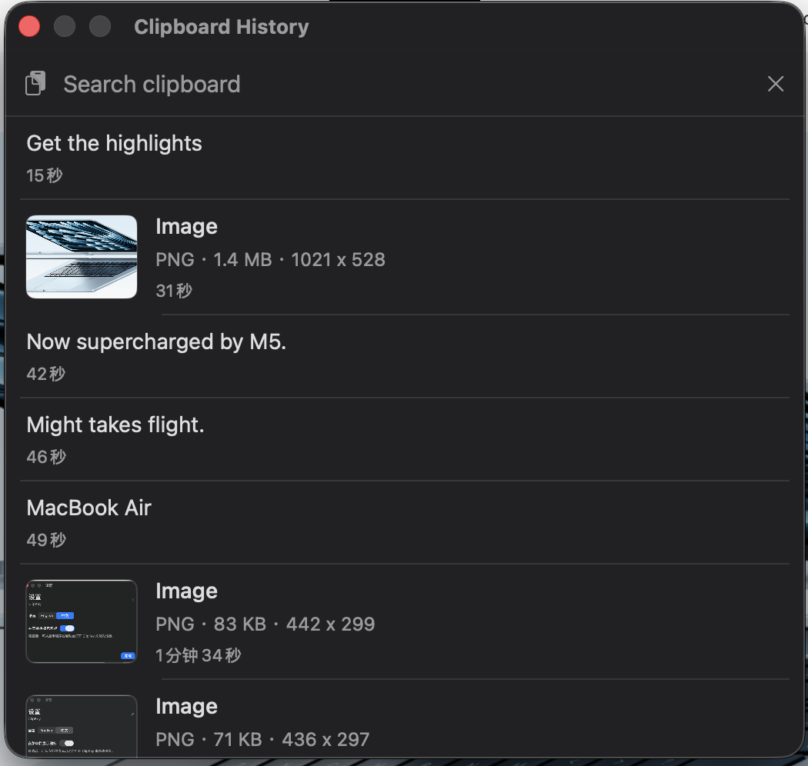
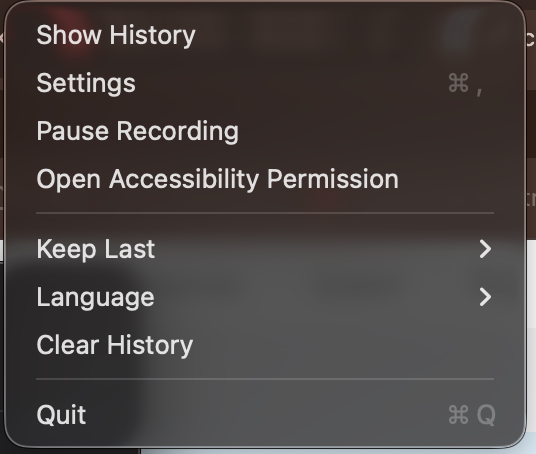
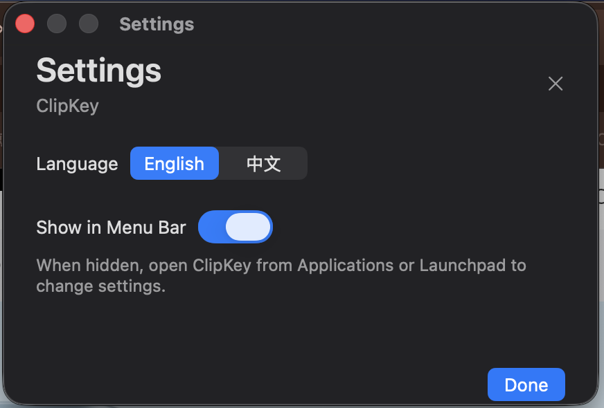
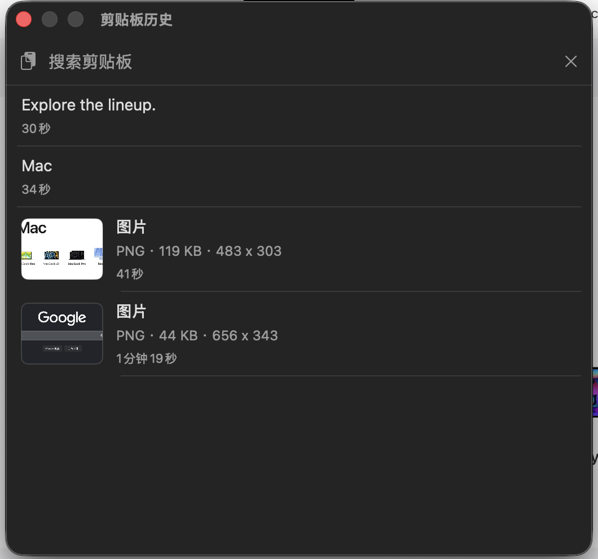
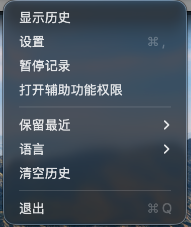
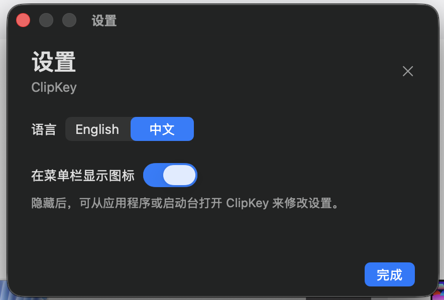

# ClipKey

**ClipKey is a lightweight, fast, simple, and free native macOS clipboard history tool.**  
It lets you open recent copied text and images with a shortcut, search your history, preview images, and paste any item back into the app you were using.

**ClipKey 是一个轻量、快速、简洁、免费的原生 macOS 剪贴板历史工具。**  
它可以用快捷键调出最近复制过的文本和图片，支持搜索、图片预览，并能把历史记录快速粘贴回当前软件。

**Download / 下载**: [ClipKey-0.1.0.dmg](https://github.com/zy-h/ClipKey/raw/main/releases/ClipKey-0.1.0.dmg)

**Language / 语言**: [English](#english) · [中文](#中文)



## English

### What It Does

macOS has a clipboard, but it does not include a simple built-in clipboard history like Windows. ClipKey adds that missing piece:

- Open clipboard history with `Command + Shift + V`.
- See recent copied text and images.
- Search history instantly.
- Preview copied images with format, file size, and dimensions.
- Click an item to restore it and paste it into the previous app.
- Keep everything local on your Mac.

### Why ClipKey

- **Lightweight**: native Swift/AppKit app, no Electron, no web runtime.
- **Fast**: designed for quick keyboard-driven clipboard access.
- **Simple**: focused on clipboard history, not a complicated productivity suite.
- **Free**: open source under the MIT License.
- **Private**: no cloud sync, no account, no network service.

### Name

`ClipKey` means **Clipboard + Key**.  
It is a clipboard history tool you can open with a keyboard shortcut.

### Screenshots

#### Clipboard History


#### Menu



#### Settings



### Features

- Native macOS menu bar app.
- Optional menu bar icon.
- Reopen ClipKey from Applications or Launchpad to show settings.
- Text history with plain text, RTF, and HTML clipboard formats when available.
- Image history with thumbnail preview, format, file size, and dimensions.
- Keep the latest 20, 30, 50, or 100 items.
- Search clipboard history.
- Click a history item to restore and paste it.
- English and Chinese interface.
- Local JSON/PNG/RTF/HTML storage only.

### Shortcut

```text
Command + Shift + V
```

### Build

Download the DMG installer:

[https://github.com/zy-h/ClipKey/raw/main/releases/ClipKey-0.1.0.dmg](https://github.com/zy-h/ClipKey/raw/main/releases/ClipKey-0.1.0.dmg)

Or build from source:

Requirements:

- macOS
- Xcode or Xcode Command Line Tools

Run:

```sh
swift run
```

Build app:

```sh
./build-app.sh
open .build/release/ClipKey.app
```

Install locally:

```sh
ditto .build/release/ClipKey.app /Applications/ClipKey.app
open /Applications/ClipKey.app
```

### Permission

ClipKey needs macOS Accessibility permission only for automatic paste after selecting a history item.

Enable it here:

```text
System Settings > Privacy & Security > Accessibility
```

### Format Note

Rich text formatting depends on the source app and the target app. ClipKey restores RTF/HTML when those clipboard formats are available and supported. Plain text fields will still paste plain text.

## 中文

### 这是做什么的？

macOS 有系统剪贴板，但没有像 Windows 那样直接可用的剪贴板历史。ClipKey 补上这个小功能：

- 用 `Command + Shift + V` 打开剪贴板历史。
- 查看最近复制过的文本和图片。
- 快速搜索复制记录。
- 图片记录支持缩略图、格式、大小和尺寸显示。
- 点击一条记录后，恢复到剪贴板并粘贴回之前的软件。
- 所有数据只保存在本机。

### 为什么用 ClipKey？

- **轻量**：原生 Swift/AppKit 实现，不是 Electron。
- **快速**：面向快捷键和高频复制粘贴场景。
- **简洁**：只做剪贴板历史，不堆复杂功能。
- **免费**：MIT 开源协议。
- **私密**：不需要账号，不联网，不做云同步。

### 名字是什么意思？

`ClipKey` 来自 **Clipboard + Key**。  
意思是“可以用快捷键打开的剪贴板历史工具”。你也可以把它理解成“快捷剪贴板”。

### 界面截图

#### 剪贴板历史



#### 菜单



#### 设置



### 功能

- 原生 macOS 菜单栏工具。
- 支持隐藏菜单栏图标。
- 隐藏后，可从“应用程序”或启动台重新打开设置页。
- 文本历史支持纯文本，并尽量保留 RTF / HTML 富文本格式。
- 图片历史支持缩略图预览，并显示格式、文件大小和尺寸。
- 可保留最近 20、30、50 或 100 条记录。
- 支持搜索历史。
- 点击历史记录后自动恢复并粘贴。
- 支持中文和英文界面。
- 数据只保存在本机。

### 快捷键

```text
Command + Shift + V
```

### 构建

可以直接下载 DMG 安装包：

[https://github.com/zy-h/ClipKey/raw/main/releases/ClipKey-0.1.0.dmg](https://github.com/zy-h/ClipKey/raw/main/releases/ClipKey-0.1.0.dmg)

也可以从源码构建：

需要：

- macOS
- Xcode 或 Xcode Command Line Tools

运行：

```sh
swift run
```

打包：

```sh
./build-app.sh
open .build/release/ClipKey.app
```

安装到本机：

```sh
ditto .build/release/ClipKey.app /Applications/ClipKey.app
open /Applications/ClipKey.app
```

### 权限说明

ClipKey 只有在“点击历史记录后自动粘贴”时需要 macOS 辅助功能权限。

请在这里开启：

```text
系统设置 > 隐私与安全性 > 辅助功能
```

### 格式说明

文本格式能否原样保留，取决于来源软件和目标软件是否支持兼容的剪贴板格式。ClipKey 会尽量保存并恢复 RTF / HTML；如果目标输入框只支持纯文本，就会粘贴为纯文本。

## License

MIT
