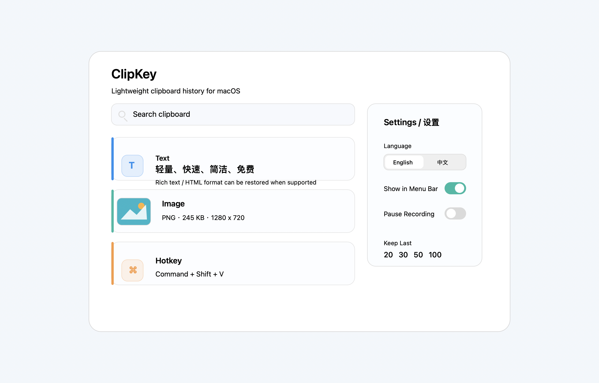

# ClipKey



**ClipKey** is a native macOS clipboard history tool that is **lightweight, fast, simple, and free**.

The name means **Clipboard + Key**: a clipboard you can open quickly with a keyboard shortcut.

## English

### Why ClipKey?

macOS has a system clipboard, but it does not provide a built-in clipboard history like Windows. ClipKey fills that small gap with a focused native utility:

- **Lightweight**: native Swift/AppKit implementation, no Electron, no web runtime.
- **Fast**: open clipboard history with `Command + Shift + V`.
- **Simple**: clipboard history, search, click to paste, and a compact settings window.
- **Free**: open source under the MIT License.
- **Private**: history is stored locally on your Mac.

### Features

- Menu bar clipboard history.
- Optional menu bar icon.
- Reopen ClipKey from Applications or Launchpad to show settings.
- Text history with plain text, RTF, and HTML clipboard formats when available.
- Image history with thumbnail preview, format, file size, and dimensions.
- Keep the latest 20, 30, 50, or 100 items.
- Search clipboard history.
- Click a history item to restore it and paste into the previous app.
- English and Chinese interface.
- Local JSON/PNG/RTF/HTML storage only.

### Shortcut

Default shortcut:

```text
Command + Shift + V
```

### Build

Requirements:

- macOS
- Xcode or Xcode Command Line Tools

Build and run:

```sh
swift run
```

Build a macOS app bundle:

```sh
./build-app.sh
open .build/release/ClipKey.app
```

Install locally:

```sh
ditto .build/release/ClipKey.app /Applications/ClipKey.app
open /Applications/ClipKey.app
```

### Permissions

ClipKey uses macOS Accessibility permission only for automatic paste after you select a history item.

If automatic paste does not work, enable ClipKey in:

```text
System Settings > Privacy & Security > Accessibility
```

### Notes

Rich text formatting depends on the source app and the target app. ClipKey restores RTF/HTML when those clipboard formats are available and supported by the destination app. Plain text fields will still paste plain text.

## 中文

### ClipKey 是什么？

**ClipKey** 是一个原生 macOS 剪贴板历史工具，目标是 **轻量、快速、简洁、免费**。

这个名字来自 **Clipboard + Key**，意思是“用快捷键打开的剪贴板”。如果你觉得这个名字不够直观，也可以把它理解成“快捷剪贴板”。

### 为什么做它？

macOS 有系统剪贴板，但没有像 Windows 那样直接可用的剪贴板历史。ClipKey 只解决这个小问题，不做复杂功能，不联网，不打扰。

### 功能

- 菜单栏剪贴板历史。
- 支持隐藏菜单栏图标。
- 隐藏后，可以从“应用程序”或启动台重新打开设置页。
- 文本历史，支持纯文本，并尽量保留 RTF / HTML 富文本格式。
- 图片历史，支持缩略图预览，并显示格式、文件大小和尺寸。
- 可保留最近 20、30、50 或 100 条记录。
- 支持搜索历史。
- 点击历史记录后自动恢复到剪贴板并粘贴到之前的软件。
- 支持中文和英文界面。
- 数据只保存在本机。

### 快捷键

默认快捷键：

```text
Command + Shift + V
```

### 构建

需要：

- macOS
- Xcode 或 Xcode Command Line Tools

运行：

```sh
swift run
```

打包成 macOS 应用：

```sh
./build-app.sh
open .build/release/ClipKey.app
```

安装到本机：

```sh
ditto .build/release/ClipKey.app /Applications/ClipKey.app
open /Applications/ClipKey.app
```

### 权限说明

ClipKey 只有在“点击历史记录后自动粘贴”时需要 macOS 辅助功能权限。

如果自动粘贴没有生效，请在这里开启：

```text
系统设置 > 隐私与安全性 > 辅助功能
```

### 格式说明

文本格式能否原样保留，取决于来源软件和目标软件是否支持兼容的剪贴板格式。ClipKey 会尽量保存并恢复 RTF / HTML；如果目标输入框只支持纯文本，就会粘贴为纯文本。

## License

MIT
